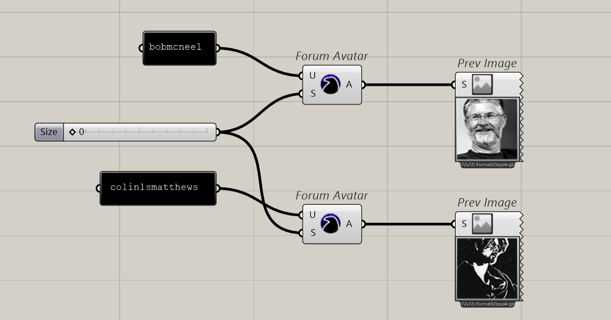
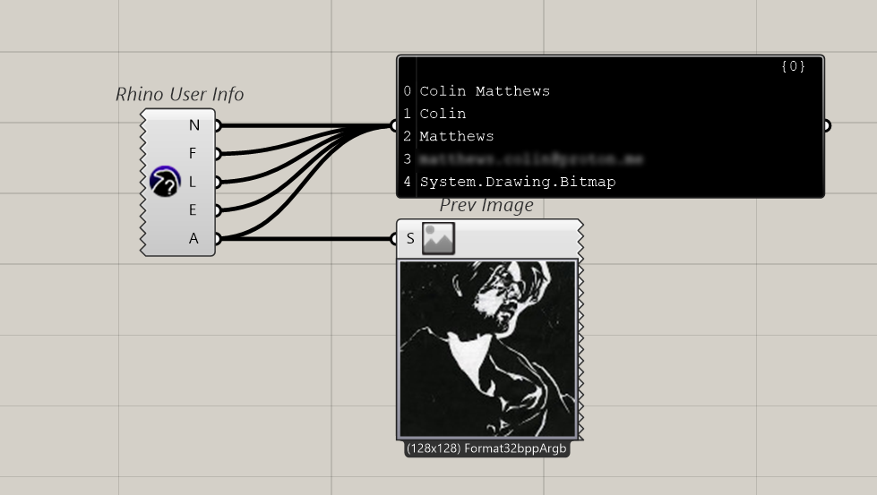
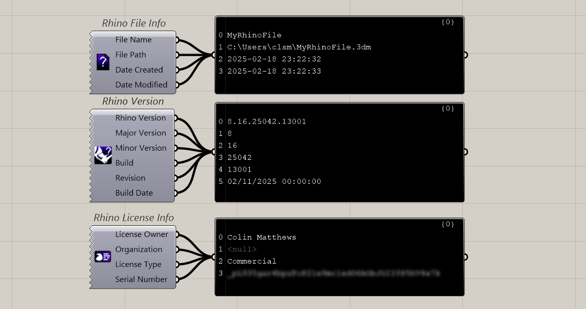
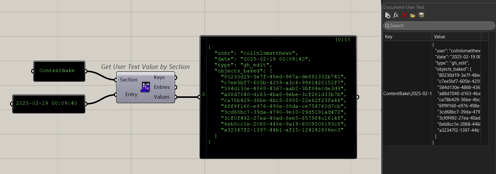
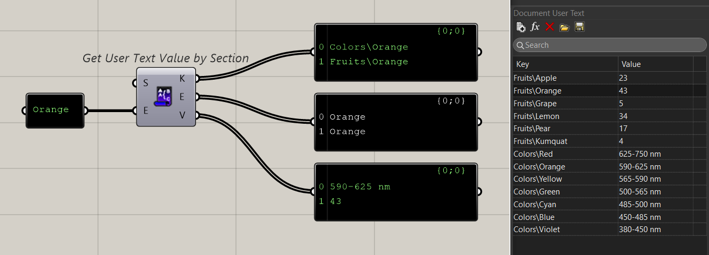
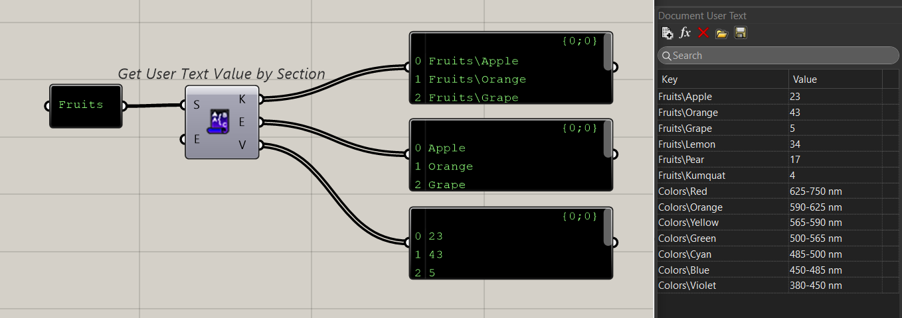
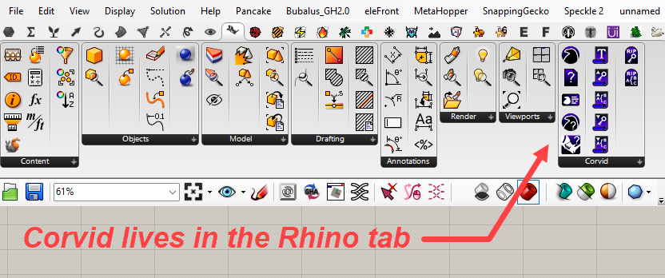

# Corvid
Among the most intelligent birds, Corvids have sharp memories and are known to remember faces. This plugin reveals information about the current user, including avatar image from the McNeel forum. You can also access information about the Rhino document and the active Rhino license, as well as read and write document user text.

In combination with other plugins such as jSwan, it's possible to embed a lot of structured information in the Rhino doc with Raven. You can use this plugin for tracking edits to the Rhino model, storing user information, or any other sort of record keeping when a Grasshopper script interacts with a Rhino document.

*Get avatar images from the McNeel forum:*

*Get Rhino user information:*

*Get information about the Rhino document, version, and license:*

*Store structured data right inside the Rhino document. Take advantage of the powerful Section/Entry user text paradigm:*

*Because this is a plugin for interacting with Rhino, it lives in the "Rhino" tab:*

## For bug reports or feature requests, please contact [support@colinlsmatthews.net](mailto:support@colinlsmatthews.net)
